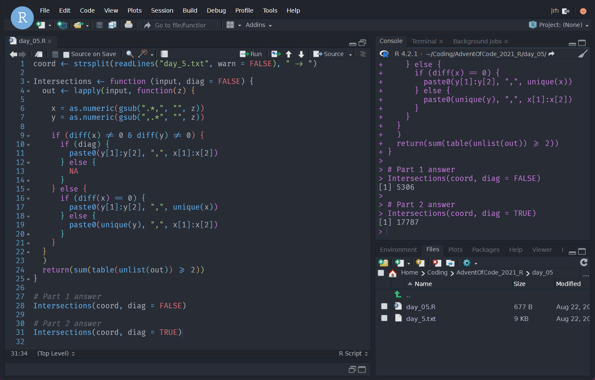

# RStudio Themes

Aesthetically pleasing RStudio themes. 

Let's be honest, RStudio isn't the prettiest IDE out there. But since RStudio v1.2 support has existed for custom themes.

Instructions for installing and applying themes can be found on [RStudios website](https://www.rstudio.com/blog/rstudio-ide-custom-theme-support/).

## Atom One Dark Pro

Slight adaptation of the original [gadenbuie/rsthemes](https://github.com/gadenbuie/rsthemes).

## Synthwave 85

Slight adaptation of the original [jnolis/synthwave85](https://github.com/jnolis/synthwave85).

## Semi-Synthwave 85

Toned down adaptation of the original [jnolis/synthwave85](https://github.com/jnolis/synthwave85).