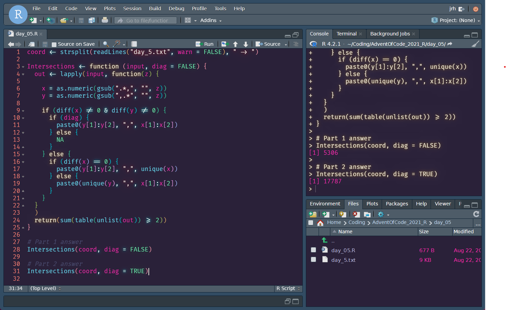

# RStudio Themes

Aesthetically pleasing RStudio themes. 

Let's be honest, RStudio isn't the prettiest IDE out there. But since RStudio v1.2 support has existed for custom themes.

Instructions for installing and applying themes can be found on [RStudio's website](https://www.rstudio.com/blog/rstudio-ide-custom-theme-support/).

## Atom One Dark Pro

<<<<<<< HEAD
Slight adaptation of the original [gadenbuie/rsthemes](https://github.com/gadenbuie/rsthemes), with a little bit of [Binaryify/OneDark-Pro](https://github.com/Binaryify/OneDark-Pro).

## Synthwave 85

Slight adaptation of the original [jnolis/synthwave85](https://github.com/jnolis/synthwave85).

## Semi-Synthwave 85

Toned down adaptation of the original [jnolis/synthwave85](https://github.com/jnolis/synthwave85).
=======
Inspired by the incredible One Dark Pro VS Code theme by [Binaryify/OneDark-Pro](https://github.com/Binaryify/OneDark-Pro).
>>>>>>> 1c6f33c (removed to rework and updated atom theme)
