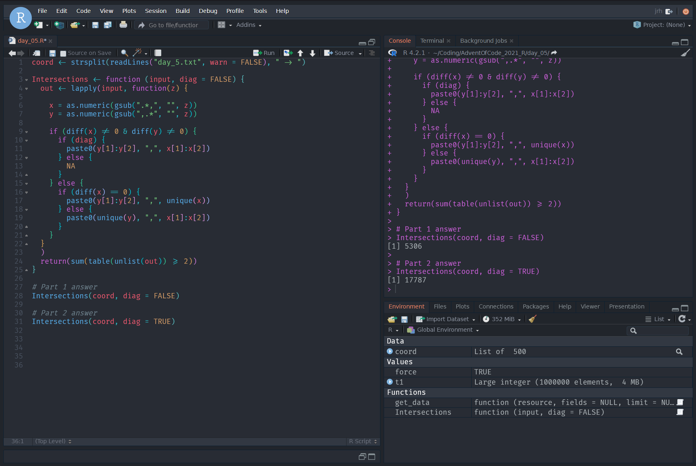

# RStudio Themes

Aesthetically pleasing RStudio themes. 

Let's be honest, RStudio isn't the prettiest IDE out there. But since RStudio v1.2 support has existed for custom themes.

Instructions for installing and applying themes can be found on [RStudio's website](https://www.rstudio.com/blog/rstudio-ide-custom-theme-support/).

## Atom One Dark Pro

Inspired by the incredible One Dark Pro VS Code theme by [Binaryify/OneDark-Pro](https://github.com/Binaryify/OneDark-Pro).
